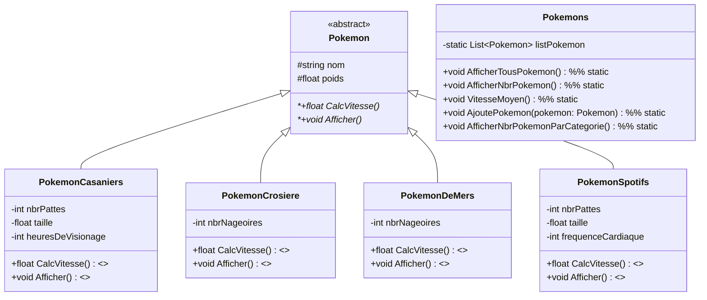

# Diagramme UML

```mermaid
	classDiagram
		class Pokemon{
			<<abstract>>
			#string nom
			#float poids
			

			*+float CalcVitesse()*
			*+void Afficher()*
		}

		class Pokemons{
			-static List~Pokemon~ listPokemon

			+void AfficherTousPokemon() %% static
			+void AfficherNbrPokemon() %% static
			+void VitesseMoyen() %% static
			+void AjoutePokemon(pokemon: Pokemon) %% static
			+void AfficherNbrPokemonParCategorie() %% static
		}
		
		class PokemonCasaniers{
			-int nbrPattes
			-float taille
			-int heuresDeVisionage

			+float CalcVitesse() <<override>>
			+void Afficher() <<override>>
		}

		class PokemonCrosiere{
			-int nbrNageoires

			+float CalcVitesse() <<override>>
			+void Afficher() <<override>>
		}

		class PokemonDeMers{
			-int nbrNageoires

			+float CalcVitesse() <<override>>
			+void Afficher() <<override>>
		}

		class PokemonSpotifs{
			-int nbrPattes
			-float taille
			-int frequenceCardiaque

			+float CalcVitesse() <<override>>
			+void Afficher() <<override>>
		}


		Pokemon <|-- PokemonCasaniers
		Pokemon <|-- PokemonCrosiere
		Pokemon <|-- PokemonDeMers
		Pokemon <|-- PokemonSpotifs
```