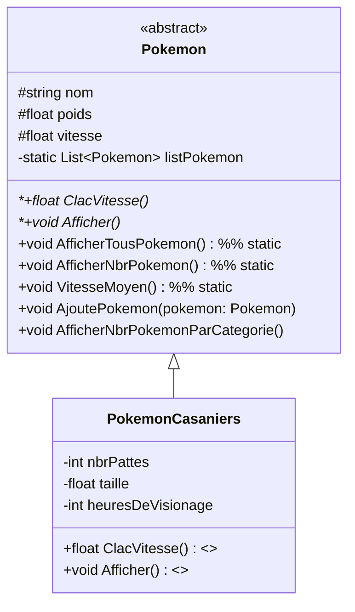

# Diagramme UML

```mermaid
	classDiagram
		class Pokemon{
			<<abstract>>
			#string nom
			#float poids
			#float vitesse
			-static List~Pokemon~ listPokemon

			*+float ClacVitesse()*
			*+void Afficher()*

			+void AfficherTousPokemon() %% static
			+void AfficherNbrPokemon() %% static
			+void VitesseMoyen() %% static
			+void AjoutePokemon(pokemon: Pokemon)
			+void AfficherNbrPokemonParCategorie()
		}
		
		class PokemonCasaniers{
			-int nbrPattes
			-float taille
			-int heuresDeVisionage

			+float ClacVitesse() <<override>>
			+void Afficher() <<override>>
		}

		Pokemon <|-- PokemonCasaniers
```